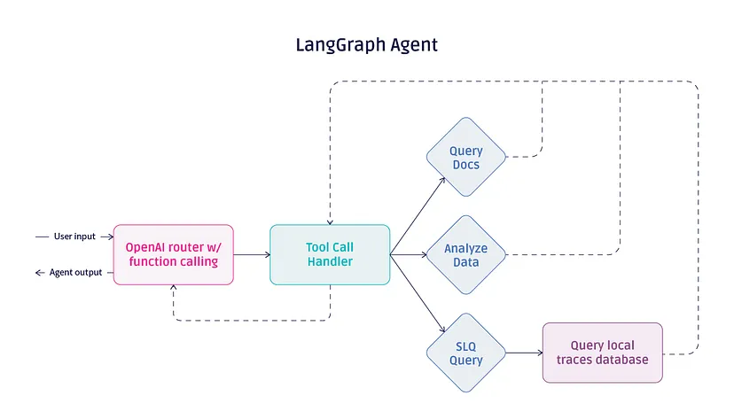

# 🟢 01-basics: 基础概念

## 📚 模块介绍

欢迎来到LangGraph基础概念模块！在这里，您将学习LangGraph框架的核心概念，包括：

- **什么是LangGraph**: 图形化状态管理框架
- **状态(State)**: 工作流中的数据容器
- **节点(Node)**: 执行具体操作的函数
- **边(Edge)**: 连接节点的路径
- **状态图(StateGraph)**: 完整的工作流定义

## 🔬 工作原理

## 🎯 学习目标

完成本模块学习后，您将能够：
- 理解LangGraph的核心概念和架构
- 创建第一个简单的状态图
- 管理工作流中的状态
- 定义和使用节点与边

## 📋 文件列表

| 文件 | 描述 | 难度 |
|------|------|------|
| `hello_world.py` | 第一个LangGraph程序 | ⭐ |
| `state_management.py` | 状态管理详解 | ⭐⭐ |
| `nodes_edges.py` | 节点和边的使用 | ⭐⭐ |

## 🚀 学习路径

### 1. Hello World (`hello_world.py`)
**目标**: 创建最简单的LangGraph应用，理解基本结构

**学习要点**:
- 如何定义状态类型
- 如何创建简单的节点
- 如何构建和编译状态图
- 如何运行工作流

### 2. 状态管理 (`state_management.py`)
**目标**: 深入理解状态在LangGraph中的作用

**学习要点**:
- 状态的数据结构设计
- 状态更新和传递
- 状态检查和验证
- 状态持久化概念

### 3. 节点和边 (`nodes_edges.py`)
**目标**: 掌握节点和边的各种使用方式

**学习要点**:
- 不同类型的节点
- 条件边的使用
- 循环和递归结构
- 复杂工作流设计

## 💡 关键概念

### State（状态）
状态是LangGraph工作流中的数据容器，定义了在工作流中流动的数据类型和结构。

### Node（节点）
节点是执行具体操作的函数，接收当前状态并返回更新后的状态。

### Edge（边）
边定义了节点之间的连接关系和执行顺序。

### StateGraph（状态图）
状态图是包含节点、边和状态定义的完整工作流。

## 🔧 运行环境

确保您已经：
1. 安装了所有依赖 (`pip install -r requirements.txt`)
2. 配置了环境变量 (`.env`文件)
3. 理解基本的Python语法

## ✅ 验证学习

完成每个文件的学习后，尝试以下练习：
1. 修改示例代码，观察结果变化
2. 添加新的节点或边
3. 改变状态的数据结构
4. 尝试创建自己的简单工作流

---

🎯 **准备好开始您的LangGraph之旅了吗？让我们从Hello World开始！**